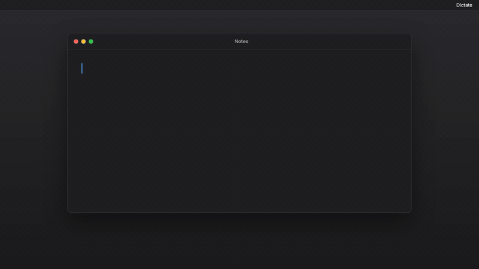

# Grok Dictate

[](LICENSE)
[](#requirements)
[](https://github.com/Fynnius/grok-dictate/releases/latest)
[](https://github.com/Fynnius/grok-dictate/actions/workflows/ci.yml)

Hold `Fn`, speak, release — the transcript is typed into whatever app has focus.

Unofficial menu-bar dictation for macOS. Standard dictation uses the public [xAI streaming speech-to-text API](https://docs.x.ai/developers/model-capabilities/audio/speech-to-text) with an xAI API key or a Grok CLI login; STT 2 Fast uses grok.com. Not affiliated with, endorsed by, or sponsored by xAI.

<p align="center">
  
</p>

|                      |                                                            |
| -------------------- | ---------------------------------------------------------- |
| `Fn` (hold)          | push-to-talk                                               |
| `Fn` + `Space`       | hands-free toggle                                          |
| `Ctrl` + `Cmd` + `V` | re-insert the last transcript wherever you are now pointed |
| `Esc`                | cancel a recording                                         |

**Dictation replaces what is on your clipboard, and does not put it back.** By default Grok Dictate pastes long text and anything going into a terminal, because typing 2,000 characters one keystroke at a time takes nearly two seconds and terminals drop it. The transcript is marked so clipboard managers skip it, and it is taken back off the pasteboard within about 200 ms of the target reading it — but whatever you had copied before is gone.

It is never _read_. There is no snapshot and no restore, deliberately: reading the pasteboard is the operation macOS has started putting a permission prompt in front of, and writing is not. If you would rather keep your clipboard, **Settings → Dictation → Insert text by → Typing** never touches it. `Ctrl+Cmd+V` re-runs insertion against an in-memory buffer and follows the same setting.

## Requirements

- macOS on Apple Silicon
- Node.js 20 or newer (to build from source)
- An [xAI API key](https://console.x.ai/team/default/api-keys), a logged-in [Grok CLI](https://docs.x.ai), **or** a grok.com login (STT 2 Fast)
- Microphone, Accessibility, and Input Monitoring permissions

## Install

### Download (Apple Silicon)

1. Get an [xAI API key](https://console.x.ai/team/default/api-keys). Streaming STT is **$0.20 / hour** ([pricing](https://docs.x.ai/docs/models#pricing)).
2. Download `grok-dictate-0.3.0-mac-arm64.zip` from the [latest release](https://github.com/Fynnius/grok-dictate/releases/latest).
3. Unzip and drag `Grok Dictate.app` to `/Applications`, then double-click it.

On macOS Sequoia and later you will see **“Grok Dictate Not Opened”** with only **Move to Trash** and **Done**. Click **Done**, then:

**System Settings → Privacy & Security → Open Anyway**

That is Apple’s supported path for an app that is not Developer ID signed and notarized. After the first exception, double-clicking works. Details: [docs/permissions.md](docs/permissions.md).

On first launch a **Sign in** window opens for an xAI API key. If you already use the Grok CLI, Grok Dictate can reuse that login and skip the window. grok.com is a third method, under Settings → Account, and is what STT 2 Fast needs.

### From source

```bash
git clone https://github.com/Fynnius/grok-dictate.git
cd grok-dictate
npm install
./native/build.sh
npm run package
open -a "Grok Dictate"
```

`npm run package` builds the Swift helper, bundles the app, ad-hoc signs it, and copies it to `/Applications/Grok Dictate.app`.

### Development

```bash
npm install
./native/build.sh
npm run dev
```

```bash
npm test        # Vitest — no Electron or network needed
npm run lint    # ESLint + Prettier
npm run typecheck
./native/test.sh
```

## First-run permissions

A packaged `.app` is its own TCC identity. Grant these once under **System Settings → Privacy & Security**:

1. **Microphone** — the orange indicator only appears while you are actually recording
2. **Accessibility** — so the helper can type into the frontmost app
3. **Input Monitoring** — so `Fn` can be detected globally

If `Fn` does nothing, the menu bar says so and offers a shortcut to the Accessibility pane. Details and a reset command: [docs/permissions.md](docs/permissions.md).

## How auth works

Three independent logins:

1. An xAI API key pasted in the Sign in window (macOS Keychain via Electron `safeStorage`)
2. A grok.com session (Settings → Account), used only by STT 2 Fast
3. A Grok CLI login in `~/.grok/auth.json` (`grok login`)

Dictation uses a stored API key first, then `XAI_API_KEY`, then the Grok CLI file. grok.com is not on that list.

This app never _itself_ refreshes a Grok CLI token — doing that from a second client can invalidate the CLI login. When the CLI token is close to expiry, Grok Dictate runs `grok models` and lets the CLI renew its own file.

The token is never logged, never written to history, and never sent to the Swift helper.

## Privacy

- Audio is streamed to xAI only while you hold the dictation key (or until you end a hands-free turn)
- Transcripts are stored locally, searchable, and stay until you delete them. Audio is kept for one day so a recording can be retried
- A pasted dictation replaces your clipboard, is marked transient so managers skip it, and is cleared once the target has read it. Nothing ever _reads_ your clipboard. **Settings → Dictation → Insert text by → Typing** leaves it alone entirely
- Secure Input (password fields, `sudo`) blocks insertion and is named in the menu bar

## Architecture

```
┌──────────────────────────────────────────────────────────┐
│ Electron main                                            │
│   state/machine.ts     pure reducer, effects as data     │
│   state/orchestrator   interprets effects against ports  │
└──────────────────────────────┬───────────────────────────┘
                               │
   ┌──────────────┬────────────┴───┬──────────────┬────────┐
   │ native/                │ stt/          │ hud/ tray/   │ history│
   │ helper + capture       │ xAI websocket │ windows      │ config │
   └──────────────┴────────────────┴──────────────┴────────┘
```

The dictation round-trip is a pure state machine that returns side effects as data, so it is testable without Electron, a microphone, or a socket. Everything crossing a boundary goes through a port in `contracts/`. See [docs/ARCHITECTURE.md](docs/ARCHITECTURE.md).

## Contributing

Issues and pull requests are welcome. See [CONTRIBUTING.md](CONTRIBUTING.md).

## Disclaimer

Grok Dictate is an **unofficial**, independently developed macOS app. It is **not** affiliated with, endorsed by, or sponsored by xAI. “Grok” and “xAI” are trademarks of xAI ([brand guidelines](https://x.ai/legal/brand-guidelines)). You use the public [Speech-to-Text API](https://docs.x.ai/developers/model-capabilities/audio/speech-to-text) with **your** key and are responsible for the [xAI terms](https://x.ai/legal/terms-of-service) and [acceptable use policy](https://x.ai/legal/acceptable-use-policy).

This repo does not ship xAI logos. Apple Silicon only. Electron, yes — the menu-bar and insertion logic is small; Chromium is the rest.

## License

[MIT](LICENSE)
